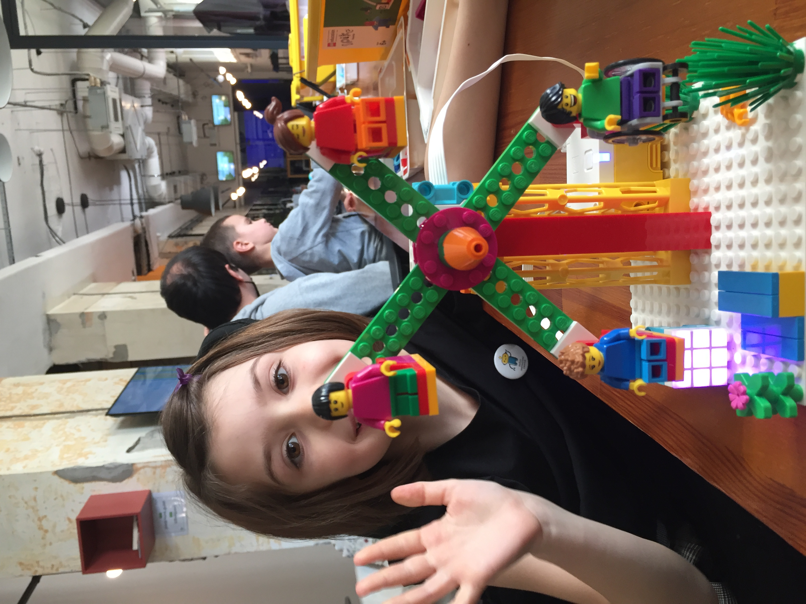
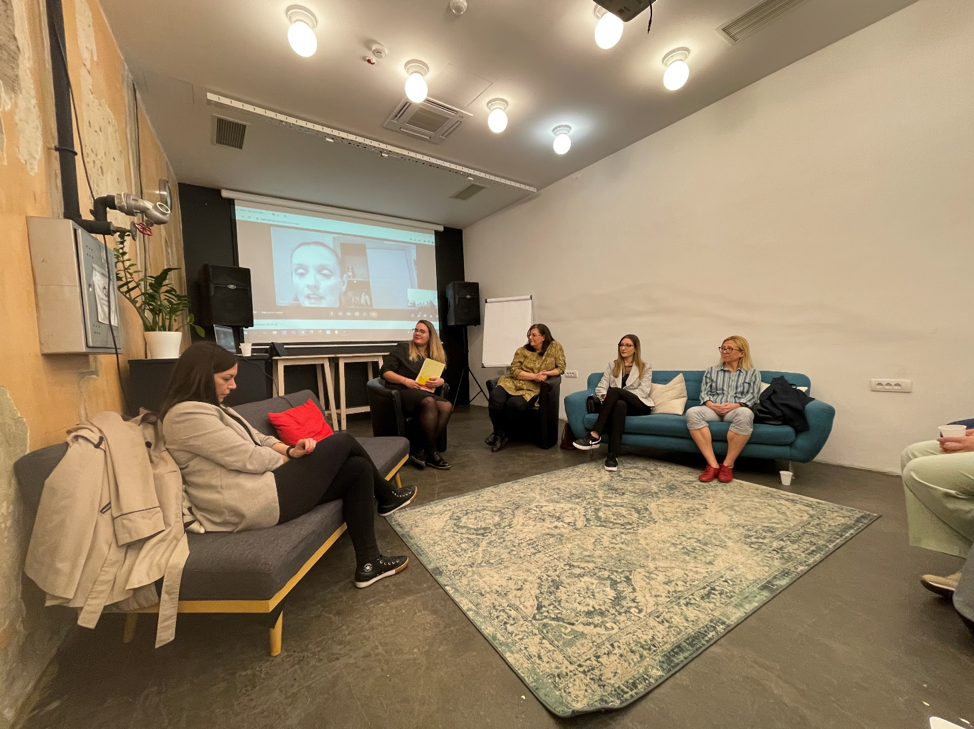
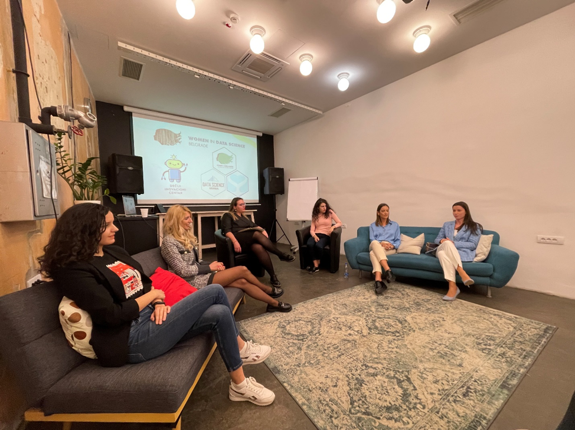
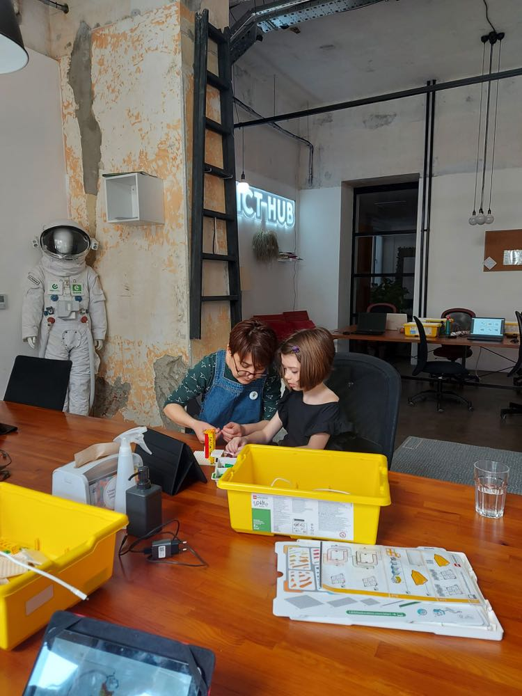

```{r setup, include=FALSE}
knitr::opts_chunk$set(echo = TRUE)
```


The first [WiDS Belgrade 2022](https://widsbg2022.netlify.app) conference, our 4th WiDS Serbia event, was a big success!

On 26th March, in [ICT Hub](https://www.icthub.rs) Belgrade, a Women in Data Science (WiDS) Belgrade 2022 was hosted by [Isidora Gatarić](https://www.linkedin.com/in/isidora-gataric/), [Valentina Đorđević](https://www.linkedin.com/in/valentina-đorđević/) and [Tatjana Kecojevic](https://www.linkedin.com/in/tatjana-kecojevic-803704143/), three WiDS Ambassadors based in Serbia. The conference is global initiative driven by [Women in Data Science (WiDS)](https://www.widsconference.org), [Stanford University (USA)](https://www.stanford.edu), and this year it was held at 200+ locations around the world. 

[WiDS Belgrade 2022](https://widsbg2022.netlify.app) event included two parts:

i) Robotics for mums and kids organised by [Anica (Vulović) Pavlović](https://www.linkedin.com/in/anica-pavlovi%C4%87-91299341/)’s [“Deciji Inovativni Centar”](http://dic.rs) and
ii)	DS panel discussion  


Robotics technology influences every aspect of work and home. Robotics has the potential to positively transform lives and work practices. With this in mind the next generation of its users needs to learn and recognise the application of STEAM as a multi and cross disciplinary concept is an empowering undertaking. 

```{r echo = F, fig.width=6, fig.height=6, fig.align='center', out.width = '60%'}

```

Encouraging a passion for Maths and Science is a starting point as is elevating the many achievements of women involved in Data Science and data driven industries in general.

```{r echo = F, fig.width=6, fig.height=6, fig.align='center', out.width = '80%'}
knitr::include_graphics("images/robotics1.jpg")
```

We at Sister Analyst believe that establishing supportive communities with a cross section of data literacy skills is a necessary step in the direction of empowering women in the workplace. Guided by this conviction, we organised four discussion panels within which we covered a wide spectrum of related DS subjects:


- Business development 
- Education 
- HR, Employment 
- Analytics and engineering

```{r echo = F, fig.width=6, fig.height=6, fig.align='center', out.width = '80%'}
knitr::include_graphics("images/wids1.jpg")
```

Four excellent panel discussions covered a wide spectrum of related DS subjects and the panellists share their personal professional experiences of working within data driven environments. Additionally, they discussed wider issues concerning entrepreneurship and education. Accordingly, on 4 panel dicussions of 4 different topics, we had 19 fantastic guests. 

The discussions began with the Business Development and Data Science panel, were
[Branislava Subotin](https://www.linkedin.com/in/branislava-subotin-7750b8137/), [Ljubica Vujović](https://www.linkedin.com/in/ljubica-vujovic-2375a885/), [Anita Jović](https://www.linkedin.com/in/anita-jovic/), [Danijela Čabarkapa](https://www.linkedin.com/in/danijela-cabarkapa-99691716/) and [Jelena Roksandić](https://www.linkedin.com/in/jelena-roksandi%C4%87/) discussed how they handle their business topics in Data Science oriented teams. 

```{r echo = F, fig.width=6, fig.height=6, fig.align='center', out.width = '80%'}
knitr::include_graphics("images/p1.jpg")
```

Educational themes were highlighted and discussed at the second panel. There [Jelena Jovanović](http://www.jelenajovanovic.net/), [Anđela Donević](https://www.linkedin.com/in/donandjela/), [Ranka Stanković](https://rgf.bg.ac.rs/page.php?page=profesori_details&id=219), [Mirjana Katić](https://www.linkedin.com/in/mirjana-katic-48b215233/) and [Katarina Anđelković](https://www.linkedin.com/in/katarina-andjelkovic-02952616/) discussed in detail the formal and informal education situation relating to Data Science in Serbia. 

```{r echo = F, fig.width=6, fig.height=6, fig.align='center', out.width = '80%'}

```

In the third panel, [Sonja Ćetković](https://www.linkedin.com/in/sonjacetkovic/), [Ivana Bučalina](https://www.linkedin.com/in/bucalina/), [Vanja Vlaški](https://www.linkedin.com/in/vanja-vlaski/) and [Ana Toskić](https://www.linkedin.com/in/ana-toskic-81349619/) dicussed employment and job/intern oportunities in the Data Science market in Serbia. Subjects such as recruitment processes  and data privacy in Serbia were debated and considered. 

```{r echo = F, fig.width=6, fig.height=6, fig.align='center', out.width = '80%'}
knitr::include_graphics("images/p3.png")
```

Our final panel was dedicated to technical subjects related to Data Science jobs, such as data analytics, data science and engineering tasks and this discussion was conducted by [Ana Dukić](https://www.linkedin.com/in/ana-dukic-55061616a/), [Marija Gavrilović](https://www.linkedin.com/in/marija-gavrilovic-67280995/), [Tamara Krivokuća](https://www.linkedin.com/in/tamara-krivokuca/), [Milena Kojić](https://www.linkedin.com/in/milena-k-57947430/) and [Tijana Dragojević](https://www.linkedin.com/in/tijana-dragojevi%C4%87-9715a6152/). 


```{r echo = F, fig.width=6, fig.height=6, fig.align='center', out.width = '80%'}

```

The conference was well attended, a fantastic first here in Belgrade and we enjoyed adopting a new format for our event. Robotics for mum and kids was a fun way to engage with children in their process of learning important STEAM related skills. Highlighting the potential for the application of STEAM as a multi and cross disciplinary concept is an empowering undertaking. Just as smart technology offer connectivity far beyond our imagination, robots are beginning to exceed physical capabilities using artificial intelligence (AI), and cognitive skills far beyond our expectations. It can help solve significant challenges such as current environmental threats and global conflicts. It is important to prepare next generation for the future, and most importantly, have fun learning and experimenting with it. 

```{r echo = F, fig.width=6, fig.height=6, fig.align='center', out.width = '60%'}

```

Panel discussions were a useful way to trigger an exchange of viewpoints among experts in response to very well thought questions from our fantastic moderator [Isidora](https://www.linkedin.com/in/isidora-gataric/). They involved on-the-spot interaction among the panellists with Isidora directing them from the beginning of each of the session to the end. All four panels sparked thought-provoking conversations between expert panellists, enabling the audience to learn from their discourse and interactions.

**WiDS Belgrade 2022** was an illustration of a simple way of the actions and activities that can be introduced to support our children to understand data driven technology for their future. Through the interactive panel discussions we meaningfully engaged with the participating actors and everyone with the desire to enter the rapidly expanding world of data.

During all of the sessions initiatives were discussed and new friendships formed and there is now a clear commitment to pushing ahead with our strategies for building on the foundations set at the conference. We are sure that we will meet up next year in an even greater number expanding our platform for networking and knowledge sharing.

```{r echo = F, fig.width=6, fig.height=6, fig.align='center', out.width = '80%'}
knitr::include_graphics("images/wids0.jpg")
```

We would like to thank [Anica (Vulović) Pavlović](https://www.linkedin.com/in/anica-pavlovi%C4%87-91299341/) and her [“Deciji Inovativni Centar”](http://dic.rs) for organising and hosting the robotics for kids and their mums workshop
```{r echo = F, fig.width=6, fig.height=6, fig.align='center', out.width = '25%'}
knitr::include_graphics("images/dic.png")
```

and to [ICT Hub](https://www.icthub.rs) for sponsoring and hosting this event at their Belgrade Hub. 

```{r echo = F, fig.width=6, fig.height=6, fig.align='center', out.width = '15%'}
knitr::include_graphics("images/icthub.png")
```


